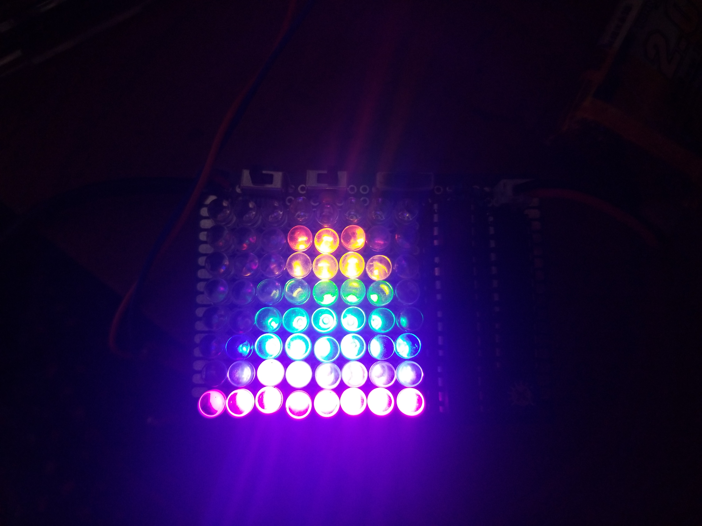
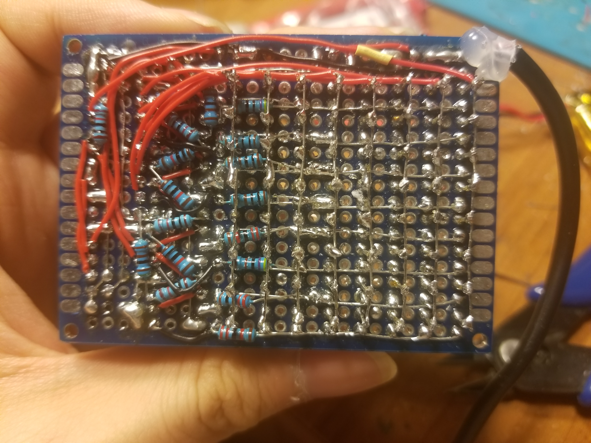
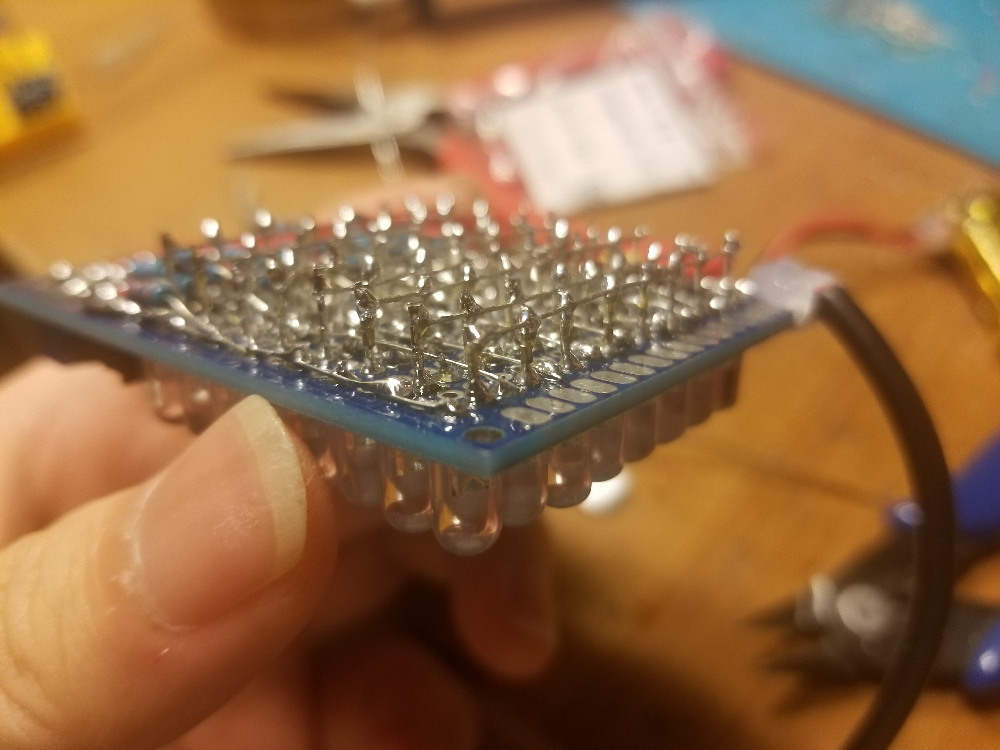

# tiny-oscilloscope
A shitty oscilloscope that no one in their right mind should build

- Channels: 1 floating analog input with selectable fixed falling edge trigger
- Vertical Range: 0-5V (1x), 0-15V (3x)
- Vertical Resolution: 3 bits
- Bandwidth: I don't know
- Sample rate: 150kSa/s
- Horizontal Resolution: 3 bits
- Memory size: 0 points
- Advanced Features: nope

This repo is designed to help people learn how to design something 
like this, both hardware and software. I hope that this can help others
with understanding basic circuit and code ideas that can be put together 
to make great things.

In the , you can learn about:
- Registers controlling the digital IO, timers 0 and 1, and interrupts
- Interrupt Service Routines and their various vectors
- Timer output compare and overflow vectors, and the superb Timer1 in general
- Multiplexing with shift registers
- Flash ADCs using discrete comparators
- How Oscilloscopes, especially Cathode Ray Scopes work: Horizontal and Vertical controls and triggering
- This project's schematic

# Compilation and Loading:

I used the Arduino IDE to upload this to an ATTINY85 using ISP and
Spence Konde's Attinycore, using these settings:

- Board: "ATtiny25/45/85 (No Bootloader)"
- Chip: "Attiny85"
- Clock: "16MHz (PLL)"
- B.O.D.: "B.O.D. disabled"
- Timer 1 Clock: "CPU"
- millis()/micros(): "disabled"

The compiled binary is 642B, allowing usage on even the ATTINY25. Since the 
code makes use of Timer1, which is pretty much unique to the 'x5 family, 
it will only work on those. You should probably just use an '85, since it is 
barely more expensive than a '25 or '45 and with much more flash/RAM.

# Assembly notes:

This project can be built on a 18x24 PTH protoboard, available straight
from China for cheap from many retailers, including Amazon. However, I HIGHLY
DISCOURAGE THIS, since the construction on such a small protoboard will be 
terribly complicated. Either use a much larger protoboard, or spin up a PCB for
this project. Have fun!

# Usage notes:

- When using this scope, it is recommended that you first power up the scope 
before attaching it to the signal source. Probably nothing very bad will happen
if you reverse these; at most some LEDs will, spuriously light up, but I would 
rather not risk it. This was hard to make!

- The potentiometer on the bottom right controls the timebase. Turn it all the
way counterclockwise, and the scope will complete one sweep at about 30Hz. Turn
if all the way clockwise, and the scope will sweep at about 16KHz. 

- The top left switch is the attenuation switch. Left, it passes the signal 
unattenuated. Right, it drops it to 1/3 of the voltage.

- The top middle switch is the coupling switch. Left, it sets the DC portion of 
the signal to about Vdd/2, thus centering the trace in the middle of the display.
Right, it passes the signal unchanged.

- The top right switch is the trigger switch. Left, it sets the scope in free-
running mode, starting one sweep after another. Right, it sets the scope into
falling-edge trigger mode, in which a sweep will only happen when the signal 
has a falling edge.

- The scope does not support measuring signals below its own ground or above Vdd, 
which is usually a battery voltage and must be between 3 and 5 volts. A 1S 
Li-ion cell is perfect for this. To measure signals outside this range, attenuate 
it and/or AC couple it to Vdd/2, via either of the switches. 
