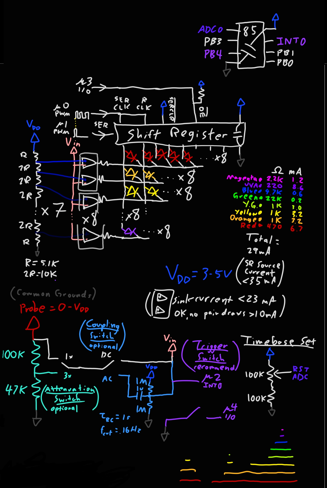

# Design Notes:

## What is an oscilloscope?

- Oscilloscopes show the voltage of a signal as it changes in time. This is more useful than, say, a multimeter reading if it changes rapidly, like an audio signal or I2C communication or BLDC motor PWM drive. 
- In its most basic form, the vertical axis of a scope display represents voltage, and the horizontal axis time. Drawing a trace of a signal on the screen shows the voltage at each point in time.
- Scopes can run in free-running mode, which means starting one sweep of a trace on the display right after the previous one is done, or much more commonly they can be triggered, which is more useful for periodic signals. A trigger is meant to start a sweep at a specified part of a waveform, making sure that the same picture shows up on the display every time, instead of a jumbled mess. For example, a scope can draw a sine wave signal, starting from when it changes from negative to positive voltage, or a rising edge trigger.

- Advanced (nowadays entry-level) scopes are marvelously powerful. They can perform Fourier transforms on signals, taking them from the time domain to the frequency domain, decode digital signals along UART, SPI, and I2C buses, do math on multiple input channels to draw products, sums, and negations, possibly output signals through their integrated frequency generators, store millions of points of data in their memory to call up past measured waveforms onto the display, and can do all this measuring the voltage on their inputs up to and beyond a *billion* times a second. 
- This scope is certainly not nearly as advanced as those made by Keysight, Textronix, or other manufacturers. But, on the other hand it will not cost you a thousand dollars!

For a more in-depth look at oscilloscopes you can check out Electroboom's video [here](https://www.youtube.com/watch?v=DgYGRtkd9Vs).

## The Software

- The software may be confusing to someone just beginning their microcontroller journey. The main method has no looping section! But, it turns out all of the looping routines are handled in interrupts. But first, let's look at the setup() section, which sets many registers to their correct values.

	- First, the global interrupt switch is disabled with cli(). This is important, since it is very bad if they start activating when they are still being set up!
	- DDRB, the Data Direction register, controls whether pins are inputs or outputs. Here, we set the SERCLK and SERDATA pins to outputs, so they can drive the shift register.
	- MCUCR, the Microcontroller Control register, controls how the external and pin change interrupts are activated. We'll get to those later. We set the external interrupt INT0 to activate on a falling edge of pin2, the INT0 pin
	- PORTB is the Pin Port B register, which controls the digital value written to the pins. When a pin is an output 1 is high and 0 is low; when it is an input, 1 is pull-up and 0 is floating.
	- GIMSK, the General Interrupt Mask, controls whether the external and pin change interrupts are enabled. We'll get to those later. We enable the INT0 interrupt.
	- TIMSK, the Timer Interrupt Mask, controls whether various timer interrupts are enabled. We'll get to those later. We enable the Timer1 Compare and Timer0 Overflow interrupts.
	- PRR, the Power Reduction register, controls whether various peripherals are turned off for power saving. We disable the Universal Serial Interface to save a few microamps.
	- DIDR0, the Digital Input Buffer register, controls whether digital input is turned off for some pins for power saving. We turn it off on the unnecessary pins to save some power.
	- TCCR0A/B, the Timer0 Control register A/B, configure Timer 0. Here we enable it in Normal mode, and give it a prescaler of 1024 - which with the 16MHz sys clock ticks the timer at 16kHz.
  
  	- Now after all the interrupts have been properly set up, we can enable interrupts globally with sei().
	
	- It is important that no more than one shift register output is ever high, since that could easily overwhelm the current capability of the multiplexing hardware. So, using PORTB we strobe the SERCLK pin 8 times while holding SERDATA low to make sure that not a single flip flop inside holds a high output. Finally, we set the  inverted OE pin to output low, pulling that pin low and enabling the output of the shift register.
  
- And now, the main method will loop doing nothing, forever. The rest of the code is a couple of ISRs, or Interrupt Service Routines. What are those?

- An Interrupt is a way for microcontrollers to respond to stimuli in a real-time manner. Consider the task of reading a button, lighting up an LED whenever it is pressed and turning it off when it is not. One way to do this is to poll the button many times per second, checking the state of the pin it is connected to and deciding the LED's state based on that. The problem is that if this polling is done infrequently there is a good chance that the CPU will not notice that the button was pressed for a while. Conversely, if polling is done frequently, this can waste a ton of CPU time.
- Probably a better way to handle this task is to assign interrupt routines. If there is an interrupt routine that turns on the LED on a falling edge of the button pin, and a routine that turns off the LED on a rising edge, then the CPU can do something else, receive an interrupt, put that other task away, handle the LED, then go right back to that task seamlessly. Very little latency happens between the button press and the LED light, and the CPU wastes very little time constantly checking for the button. If the thing that activates an interrupt is independent from the CPU, like the ATTINY timer peripherals, then the CPU does almost no work at all!
- Interrupts on the ATTINYx5 can be activated through numerous vectors, including RESET, INT0 external interrupt, PCINT0 pin change interrupt, TIMER0/1_COMPA/B timer compare match, TIMER0/1_OVF timer overflow, ADC conversion complete, and more. Note that some of these can be caused by the microcontroller itself, which can be very useful when setting up timed events that should not depend on the CPU to time them.
- Finally, let's look at the first of our interrupt service routines, or ISRs.

	- ISR(TIMER0_OVF_vect) is the ISR that activates when Timer0 overflows. The setup section configured Timer0 to count up to 255 and then overflow back to 0, endlessly, with timer ticks happening at 16kHz. This means that a timer overflow will happen at 64Hz, so this routine pretty much unconditionally fires every 1/64th of a second. It is responsible for configuring Timer1.
  
		- The ADC reading of the reset pin is taken with analogRead(A0). You could eliminate this Arduino function call and replace it with ADC register changes, explained in my tiny-simon project, but that is not necessary. 
		- Some signal processing is done to the reading, first denoising it by filtering out small changes, then constraining it to the range 514-1023. Remember, this is the reset pin, so the reading can never be much less than 512, otherwise the chip would have reset.
		- The ocrTable[] lookup table can only be explained once Timer1 is understood. Timer0 is almost identical across the entire ATTINY range, and is useful for general purpose PWM and counting. However, it has its limits. With prescaler values of 1, 8, 64, 256, and 1024 combined with a range of possible values from 1-255, it lacks a way to produce high resolution waveforms in the frequency ranges between prescalers. Compare that to Timer1, which on the ATTINYx5 range, has prescaler taps for *every* power of two from 2 to 16384. This means that by setting the Output Compare Register 1, or OCR1 appropriately, nearly every frequency from 4Hz to 16MHz can be represented, with low error. This makes it ideal, say, for setting the horizontal timebase on our scope.
		- ocrTable[] contains 34 values distributed evenly from 128 to 255, in geometric sequence. That is, there is roughly a constant factor that multiplying one value with will result in the next value. But why is it lower bounded at 128? Well, consider that an OCR of 128 and prescaler of X is *equivalent* to a OCR of 256 and prescaler of X/2. The timer counts twice as fast, to a target twice as large. Therefore, there is no need to have OCR values under 128, since you can just drop the prescaler by a factor of 2, and multiply the OCR by 2. Thus, a wide range of Timer1 compare match frequencies is possible. 
		- We use the constrained ADC reading from before, which must be one of 510 values. This is chosen because there are 15 prescaler values, and 34 ocr values, which multiplied make up 510 evenly distributed frequencies spanning nearly a factor of 1000. Simply choose the right combination of these from the reading - low ADC readings are low frequencies and high ones high frequencies, then set TCCR1 to enable CTC mode and include the right prescaler, as well as setting registers OCR1A and OCR1C to the correct value from ocrTable[].
		- In CTC mode, or Clear Timer on Compare Match, Timer1 will count up from 0. Once TCNT1 reaches the same value as OCR1C, then it will clear to 0 again. By changing OCR1C, the frequency of these clears can be changed. The problem is that compare matches with OCR1C can't generate an interrupt, which we definitely want. But that is ok, since compare match with OCR1A and OCR1B can! So, we just set both OCR1A and OCR1C to the same value. That way, once TCNT1 counts high enough it both generates an interrupt *and* clears the timer.
   
	- ISR(TIMER1_COMPA_vect) is next. This interrupt is configured to fire at a frequency set by the previous ISR(TIMER0_OVF_vect) and controlled by the potentiometer. What does this do? It starts oscilloscope sweeps when the trigger mode is set to free-running.
  
		- The volatile uint8_t serTimer is important. It guarantees that no more than one column of LEDs is ever on at the same time. If this weren't true, then the scope's display would not be very readable. The whole point of multiplexing is that only one column is on at a time, so the individual LEDs in that row can be controlled independently of each other.
		- While not strictly required in this case, it is a good idea to declare all variables that can be changed in interrupts as volatile. This makes sure the compiler knows that its value can change at any time, since otherwise it has no idea when a specific ISR might happen, and could just optimize out the variable.
		- Later on in the code, any time a sweep is started serTimer is set to 6 or 7. It also counts down once every time the SERCLK input is strobed. Thus, it takes 7 strobes for the high input to be flushed out of the shift register, and also for serTimer to be equal to 0 again.
		- Therefore, if serTimer is 0, and the pin4 digital input is high, indicating that the trigger switch is set to free-running mode, it is time to start a sweep. The routine sets the SERDATA output pin high, and sets serTimer to 7 again to count down for the next time this will happen.
		- This routine is responsible not just for starting the sweep, but for sweeping the trace across the display. This is done by strobing SERCLK, which this routine does whether it is time to start a sweep or not. SERCLK is set high, then immediately set low. At this point, SERDATA is also set low, regardless of whether it was high or not. And finally, serTimer is decremented as long as it is not 0, since one strobe was completed.
   
	- Almost done, just one ISR left. This is IST(INT0_vect), which is activated by the external interrupt INT0. The setup configured this to activate on a falling edge of the signal, or when it changes from high to low.
    
		- The beginning is very similar to the previous ISR. If serTimer is 0, and the trigger switch is set to trigger mode, then it is time to start a triggered sweep. Set SERDATA high, then SERCLK high, then both low. serTimer can be set to 6, since that is the same as if it was set to 7 then decremented once.
		- The last line, TCNT1 = 0, is important. Imagine if OCR1A was 129, and TCNT1 was 127, or just 2 ticks away from compare matching and activating the TIMER1_COMPA interrupt. If the INT0 interrupt activated, then the sweep would start with the first column lighting up, but just 2 ticks later it would move on to the second column, instead of the correct 129 ticks between SERCLK strobes. By clearing TCNT1 ourselves upon this interrupt firing we make sure that the same number of ticks happens between any two SERCLK strobes.
    
- That's it! Just 3 small ISRs and a bit of setup makes a functioning oscilloscope program! It is wonderful in its simplicity.

## The Hardware

### The aqcuisition stage

- The oscilloscope probe can be designed pretty freely. I used a headphone cable, stripped off the ends, soldered one end onto the scope and used alligator clips to terminate the other end. Don't worry about noise performance; the scope is far too low-resolution to detect realistic noise anyway.
- Each IC in the scope has ESD protection diodes that shunt away voltages higher than Vdd or lower than ground, which are great for the scope's longevity. However, if you foresee yourself being a bit careless with the probe and sticking it across 15V or something, it may be wise to introduce a 10k resistor in the probe so that no matter what the ESD diodes don't have to conduct much current, saving them from destruction.
- The attenuation switch controls attenuation. Either it passes the signal unchanged, or it puts it through a voltage divider that reduces it to about one-third of the voltage. I used 47k and 100k resistors because they were high enough. However, this presents a constant load impedance of at most 147k, which is not good for signal sources with source impedances in the megaohms. Consider bumping these resistors up by a factor of 10 or even 100 if you want to measure high impedance signals. But, keep in mind that the ADC later on will have an input impedance of about 1Tohm anyway, so no point going higher than that. Also, the higher resistance, the more thermal noise you introduce. I am not sure if even a 100M resistor would present a problem there, but whatever.
- The coupling switch controls coupling. Either it passes the signal unchanged (DC coupling), or it AC couples it to Vdd/2. This is achieved with a blocking capacitor acting as a high-pass filter. The low frequency components, i.e. DC are blocked and the high-frequency components (the relevant signal) are passed through. The resistors and capacitor together make a RC time constant of 1 second, so the cutoff frequency is 0.16Hz. These can be changed pretty much freely, as long as the time constant is not too long. If it is too long, the signal will take forever to settle. You must use a nonpolar capacitor though, since there is pretty much no telling the DC voltage that must be filtered out.
- The bias resistors create a voltage of Vdd/2 at the other end of the capacitor because a signal swinging around that will appear centered on the middle of the screen. You are of course free to change this bias voltage, but I don't recommend it. Why would you want the signal to be less displayable?
- The interrupt switch simply connects the microcontroller pin4 to ground. Also, the processed input is piped directly into the microcontroller pin2, where it can activate the INT0 external interrupt. You can change out this connection for a Schmitt trigger with the other input set to whatever trigger voltage you want. This would really clean up the scope trigger functionality. I recommend this change, however I had no space on my board left. 
- Sprinkling some voltage buffers along the acquisition stage is a good idea. Particular points where one would be good are right after the probe and between each switch. However, I had no space on my board left.

### The timebase potentiometer

- The potentiometer presents a voltage to the reset pin of the microcontroller. Because of that, in normal operation this voltage cannot go below about Vdd/2. So, put a resistor of equal value to the potentiometer below the potentiometer, to limit its minimum voltage to Vdd/2. This turns the 10-bit ADC of the ATTINY85 into a 9-bit, but that is OK.

### The microcontroller

- Only pin2 (INT0) and pin5 (ADC0) are used for a special purpose, the rest can be assigned pretty much randomly.

### The 8x8 LED display

- I used 8 each of 8 colors of LEDs, since I did not have 64 of a single color of LED. I used red, orange, yellow, yellow-green, true green, blue, ultraviolet, and magenta.
- The 64 LEDs are multiplexed in an 8-by-8 grid. The sources are the outputs of the shift register, and they are arranged in columns. The sinks are the comparator outputs, and they are arranged in rows. There is a current-limiting-resistor on each row, which I sized approximately to make each color of LED have the same visual brightness. It is astounding that the true green LEDs, with the high sensitivity of human eyes to green and their high efficiency, can be seen easily at just 100 microamps of current and are already dazzling at 1 milliamp. At their rated 20 milliamps, a single true green LED is impossible to look at!
- There needs to be only one resistor in a row because no more than one LED in each row should ever be on, since no more than one shift register output should be high. If this was not the case, then 64 individual resistors would be necessary.

### The shift register

- A shift register is a series of cascaded d-type flip flops. When the clock is strobed, each flip flop passes its output to the next one. The first flip flop will take its input from the overall input, and usually the last flip flop's output is trashed.
- The kind of shift register useful for this application is a SIPO shift register, for Serial In, Parallel Out. In this kind of shift register, serial data can be fed in through SERDATA, and each cascaded flip flop's output can be accessed individually, or in parallel.
- The most common shift registers today stem from the old 74' family of digital logic ICs. I used the SN74HC595 SIPO shift register, which has some special pins on top of the SER(DATA), SERCLK, QA-QH pins. RCLK, when strobed, latches the cascaded flip flops' outputs into the storage registers that actually present the outputs QA-QH. I tied this pin directly to SERCLK. invert SERCLR clears every cascaded flip flop immediately; I tied this high. invert OE is the output enable switch, which can high-Z the outputs immediately. This pin is controlled by the microcontroller.

### The flash ADC

- A flash ADC is the simplest type of ADC out there. Instead of successively approximating an input voltage with a DAC and binary math, or integrating it over time and spitting out a signal value, this type simply pipes the input into a bunch of comparators, each with a different reference voltage on the other input. In this scope, 8 evenly spaced voltages between Vdd and ground are supplied to the 8 comparators, while the probe input is too. The comparators lower down have a lower reference voltage on their inverting input, and will output high at lower probe input voltage on their non-inverting input. Higher up comparators will output high only when the probe input is higher. Simple!
- Since these comparators are being operated as sinks, the reference voltage is actually passed to their non-inverting input, and the probe to their inverting input. So, a high enough probe voltage will set the output of the comparator *low*, sinking current from the LEDs.
- The disadvantage of a flash ADC is its cost. To make just a 3-bit ADC, you need 7 comparators. For a 10-bit ADC, you need 1023 of them, which is prohibitively expensive in a $2 ATTINY. So, although flash ADCs offer optimum speed, they are rarely used in ordinary situations.
- Using op-amps as comparators is pretty much perfectly fine for this application, and is what I did. However, most comparators out there are open-drain instead of push-pull, which I accounted for. That is why the comparators are only responsible for sinking current, never sourcing it. Additionally, using Schmitt trigger comparators would also be fine, but I really don't think that is necessary.
- Whatever you end up using, it is important that your op-amps/comparators are *rail-to-rail input and output*, or RRIO. This means that they can take inputs all the way from ground to Vdd, and output from ground to Vdd. Non-RRIO op-amps might only accept inputs from Vss + 1V to Vdd - 1V, which cuts off more than half the usable range when powered from a 3.7V battery! Very bad! I use the low-cost, low-power Microchip MCP600x RRIO op-amps. Two 6004 quad op-amps would work, and save some space, but I used four 6002 dual op-amps. 

### The power source

- Power the board from 3-6V. Any lower, and the lower wavelength LEDs will not light up. Any higher and the ICs might be damaged. A 1S Li-Ion cell is perfect, which is why my board included a JST PH 2pin connector to connect it. Mind the polarity! JST PH connectors don't have standardized polarity!
